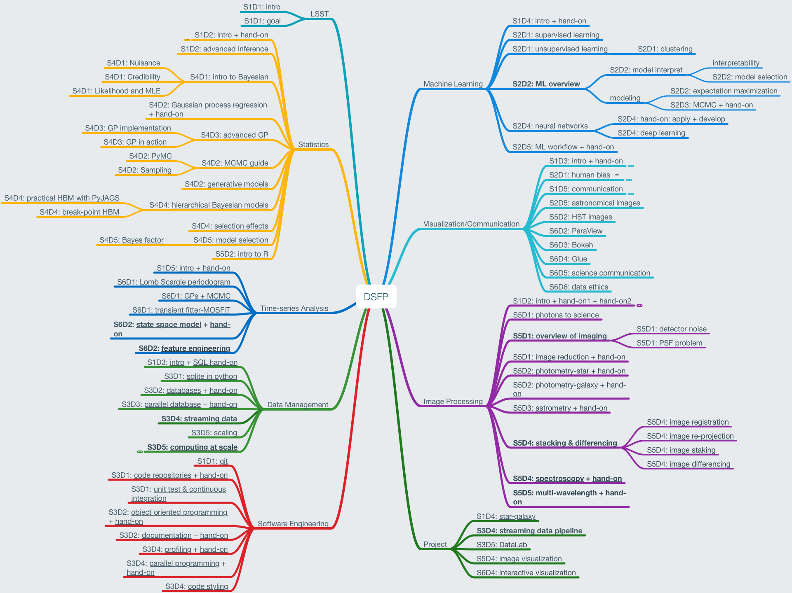
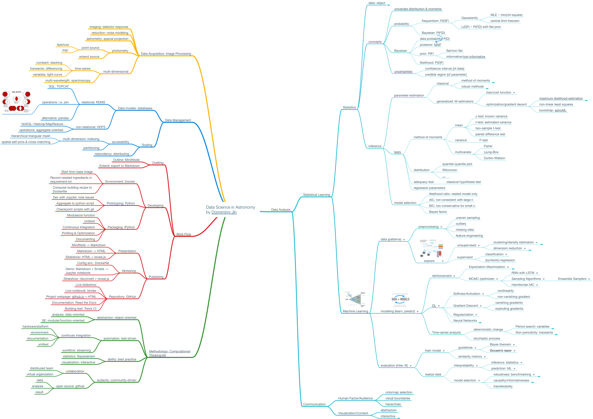
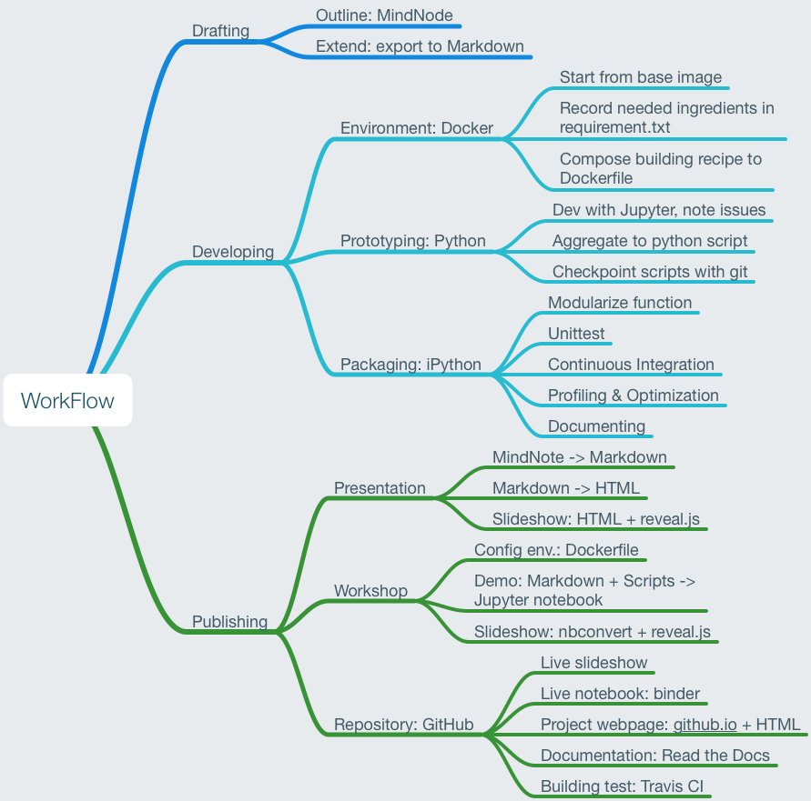

# LSST_DSFP-review
Review of the first 6 Sessions in LSST DSFP by [Dongming Jin](http://domij.info)

TOC

* [Curriculum in a map](#curr)
* [Methodology in a map](#meth)
* [WorkFlow in a map](#workflow)
* [Appendix: linked Curriculum](#app)

A few links
- [LSST DSFP website](https://astrodatascience.org/)
- [LSST DSFP Github Page](https://github.com/LSSTC-DSFP/LSSTC-DSFP-Sessions)
- [About Me](http://dongming.uta.cloud/pages/about-me.html)
- [My thought about the WorkFlow for Open Research](http://dongming.uta.cloud/workflow-and-methodology.html)

## <a name='curr'>Curriculum</a>

## <a name='meth'>Methodology</a>

## <a name='workflow'>WorkFlow</a>

See my [article](http://dongming.uta.cloud/workflow-and-methodology.html) and the converted[talk](http://dongming.uta.cloud/pdfs/WorkFlow.html#/title-slide) about adopting this workflow.

## <a name='app'>Appendix: Linked Curriculum</a>

### Machine Learning

#### S1D4: [intro + hand-on](https://github.com/LSSTC-DSFP/LSSTC-DSFP-Sessions/blob/master/Session1/Day4/DSFP_Intro2MachLearn.pdf)

#### S2D1: [supervised learning](https://github.com/LSSTC-DSFP/LSSTC-DSFP-Sessions/blob/master/Session2/Day1/ReIntroToMachineLearning.ipynb)

#### S2D1: [unsupervised learning](https://github.com/LSSTC-DSFP/LSSTC-DSFP-Sessions/blob/master/Session2/Day1/UnsupervisedLearning.pdf)

##### S2D1: [clustering](https://github.com/LSSTC-DSFP/LSSTC-DSFP-Sessions/blob/master/Session2/Day1/Unsupervised%20machine%20learning.ipynb)

#### **S2D2**: [**ML overview**](https://github.com/LSSTC-DSFP/LSSTC-DSFP-Sessions/blob/master/Session2/Day2/DSFP2017-Intro2ML4Astro.pdf)

##### S2D2: [model interpret](https://github.com/LSSTC-DSFP/LSSTC-DSFP-Sessions/blob/master/Session2/Day2/InterpretationOfMachineLearningModels.pdf)

- interpretability

- S2D2: [model selection](https://github.com/LSSTC-DSFP/LSSTC-DSFP-Sessions/blob/master/Session2/Day2/ModelSelection_Exercise.ipynb)

##### modeling

- S2D2: [expectation maximization](https://github.com/LSSTC-DSFP/LSSTC-DSFP-Sessions/blob/master/Session2/Day2/DSFP2017-EM.pdf)

- S2D3: [MCMC + hand-on](https://github.com/LSSTC-DSFP/LSSTC-DSFP-Sessions/blob/master/Session2/Day3/DSFP2017-MCMC.pdf)

#### S2D4: [neural networks](https://github.com/LSSTC-DSFP/LSSTC-DSFP-Sessions/blob/master/Session2/Day4/IntroToNeuralNetworks.ipynb)

##### S2D4: hand-on: [apply + develop](https://github.com/LSSTC-DSFP/LSSTC-DSFP-Sessions/blob/master/Session2/Day4/BasicNeuralNetworkExercise.ipynb)

##### S2D4: [deep learning](https://github.com/LSSTC-DSFP/LSSTC-DSFP-Sessions/blob/master/Session2/Day4/Mahabal_LSSTDSFP_20170126.pdf)

#### S2D5: [ML workflow + hand-on](https://github.com/LSSTC-DSFP/LSSTC-DSFP-Sessions/blob/master/Session2/Day5/DSFP_PractialMachLearn.pdf)

### Visualization/Communication

#### S1D3: [intro + hand-on](https://github.com/LSSTC-DSFP/LSSTC-DSFP-Sessions/blob/master/Session1/Day3/DSFP_Intro2Viz.pdf)

##### colormap

- luminance: high spatial frequency data  
- saturation: low spatial frequency data
- color-blind-proof:  viridis

#### S2D1: [human bias](https://github.com/LSSTC-DSFP/LSSTC-DSFP-Sessions/blob/master/Session2/Day1/WhyAndHowOfDataVisualization.pdf)

#### S1D5: [communication](https://github.com/LSSTC-DSFP/LSSTC-DSFP-Sessions/blob/master/Session1/Day5/TalkOnTalks.pdf)

#### S2D5: [astronomical images](https://github.com/LSSTC-DSFP/LSSTC-DSFP-Sessions/blob/master/Session2/Day5/ImageVizSlides.ipynb)

#### S5D2: [HST images](https://github.com/LSSTC-DSFP/LSSTC-DSFP-Sessions/blob/master/Session5/Day2/HSTOutreachImagingLSSTC.pdf)

#### S6D2: [ParaView](https://github.com/LSSTC-DSFP/LSSTC-DSFP-Sessions/blob/master/Session6/Day2/IntroToParaView.ipynb)

#### S6D3: [Bokeh](https://github.com/LSSTC-DSFP/LSSTC-DSFP-Sessions/blob/master/Session6/Day3/Bokeh.ipynb)

#### S6D4: [Glue](https://github.com/LSSTC-DSFP/LSSTC-DSFP-Sessions/blob/master/Session6/Day4/IntroductionToGlueSolutions.ipynb)

#### S6D5: science communication

#### S6D6: data ethics

### Image Processing

#### S1D2: [intro + hand-on1 + hand-on2](https://github.com/LSSTC-DSFP/LSSTC-DSFP-Sessions/blob/master/Session1/Day2/ImageProcessing/ImageProcessing.pdf)

#### S5D1: [photons to science](https://github.com/LSSTC-DSFP/LSSTC-DSFP-Sessions/blob/master/Session5/Day1/PhotonsArentScience.ipynb)

#### **S5D1**: [**overview of imaging**](https://github.com/LSSTC-DSFP/LSSTC-DSFP-Sessions/blob/master/Session5/Day1/ImageNoise.pdf)

##### S5D1: [detector noise](https://github.com/LSSTC-DSFP/LSSTC-DSFP-Sessions/blob/master/Session5/Day1/NoiseProblem.ipynb)

##### S5D1: [PSF problem](https://github.com/LSSTC-DSFP/LSSTC-DSFP-Sessions/blob/master/Session5/Day1/PSFProblem.ipynb)

#### S5D1: [image reduction + hand-on](https://github.com/LSSTC-DSFP/LSSTC-DSFP-Sessions/blob/master/Session5/Day1/Tollerud_imred.pdf)

#### S5D2: [photometry-star + hand-on](https://github.com/LSSTC-DSFP/LSSTC-DSFP-Sessions/blob/master/Session5/Day2/introtophotometry.pdf)

#### S5D2: [photometry-galaxy + hand-on](https://github.com/LSSTC-DSFP/LSSTC-DSFP-Sessions/blob/master/Session5/Day2/IntroToPhotometryGalaxies.pdf)

#### S5D3: [astrometry + hand-on](https://github.com/LSSTC-DSFP/LSSTC-DSFP-Sessions/blob/master/Session5/Day3/introtoastrometry.pdf)

#### **S5D4**: [**stacking & differencing**](https://github.com/LSSTC-DSFP/LSSTC-DSFP-Sessions/blob/master/Session5/Day4/stackdiff_Narayan/docs/stacking_and_diffim_LSSTDSFP5_Baltimore_Narayan.pdf)

##### S5D4: [image registration](https://github.com/LSSTC-DSFP/LSSTC-DSFP-Sessions/blob/master/Session5/Day4/stackdiff_Narayan/01_Registration/Register_images_exercise.ipynb)

##### S5D4: [image re-projection](https://github.com/LSSTC-DSFP/LSSTC-DSFP-Sessions/blob/master/Session5/Day4/stackdiff_Narayan/02_Reprojection/Reproject_images_exercise.ipynb)

##### S5D4: [image staking](https://github.com/LSSTC-DSFP/LSSTC-DSFP-Sessions/blob/master/Session5/Day4/stackdiff_Narayan/03_Stacking/Stacking_images_exercise.ipynb)

##### S5D4: [image differencing](https://github.com/LSSTC-DSFP/LSSTC-DSFP-Sessions/blob/master/Session5/Day4/stackdiff_Narayan/04_Differencing/Differencing_images_challenge_exercise.ipynb)

#### **S5D4**: [**spectroscopy + hand-on**](https://github.com/LSSTC-DSFP/LSSTC-DSFP-Sessions/blob/master/Session5/Day4/Spectroscopy.pdf)

#### **S5D5**: [**multi-wavelength + hand-on**](https://github.com/LSSTC-DSFP/LSSTC-DSFP-Sessions/blob/master/Session5/Day5/MultiwavelengthSlides.pdf)

### Project

#### S1D4: [star-galaxy](https://github.com/LSSTC-DSFP/LSSTC-DSFP-Sessions/blob/master/Session1/Day4/StarGalaxyRandomForest.ipynb)

#### **S3D4**: [**streaming data pipeline**](https://github.com/LSSTC-DSFP/LSSTC-DSFP-Sessions/blob/master/Session3/Day4/ANTARES/miniAntares_parallel.ipynb)

#### S3D5: [DataLab](https://github.com/noao-datalab/LSST_DSF)

#### S5D4: [image visualization](https://github.com/LSSTC-DSFP/LSSTC-DSFP-Sessions/blob/master/Session5/Day4/VisualizationExercise.ipynb)

#### S6D4: [interactive visualization](https://github.com/LSSTC-DSFP/LSSTC-DSFP-Sessions/blob/master/Session6/Day4/BeyondMatplotlib.ipynb)

### Software Engineering

#### S1D1: [git](https://github.com/jakevdp/git-intro/blob/master/git-intro.ipynb)

#### S3D1: [code repositories + hand-on](https://github.com/LSSTC-DSFP/LSSTC-DSFP-Sessions/blob/master/Session3/Day1/Tollerud_repos_slides.pdf)

#### S3D1: [unit test & continuous integration](https://github.com/LSSTC-DSFP/LSSTC-DSFP-Sessions/blob/master/Session3/Day1/Tollerud_testing_slides.pdf)

#### S3D2: [object oriented programming + hand-on](https://github.com/LSSTC-DSFP/LSSTC-DSFP-Sessions/blob/master/Session3/Day2/OOP_slides.pdf)

#### S3D2: [documentation + hand-on](https://github.com/LSSTC-DSFP/LSSTC-DSFP-Sessions/blob/master/Session3/Day2/Tollerud_docs_slides.pdf)

#### S3D4: [profiling + hand-on](https://github.com/LSSTC-DSFP/LSSTC-DSFP-Sessions/blob/master/Session3/Day4/profiling.pdf)

#### S3D4: [parallel programming + hand-on](https://github.com/LSSTC-DSFP/LSSTC-DSFP-Sessions/blob/master/Session3/Day4/parallel_slides.pdf)

#### S3D4: [code styling](https://github.com/LSSTC-DSFP/LSSTC-DSFP-Sessions/blob/master/Session3/Day4/CodeStyle.ipynb)

### Data Management

#### S1D3: [intro + SQL hand-on](https://github.com/LSSTC-DSFP/LSSTC-DSFP-Sessions/blob/master/Session1/Day3/LSST-DSFP-Budavari-SQL-v2.pdf)

#### S3D1: [sqlite in python](https://github.com/LSSTC-DSFP/LSSTC-DSFP-Sessions/blob/master/Session3/Day1/ReIntroToDatabases.ipynb)

#### S3D2: [databases + hand-on](https://github.com/LSSTC-DSFP/LSSTC-DSFP-Sessions/blob/master/Session3/Day2/AlSayyadSlidesDM1_slides.pdf)

#### S3D3: [parallel database + hand-on](https://github.com/LSSTC-DSFP/LSSTC-DSFP-Sessions/blob/master/Session3/Day3/AlSayyadSlidesDM2_slides.pdf)

#### **S3D4**: [**streaming data**](https://github.com/LSSTC-DSFP/LSSTC-DSFP-Sessions/blob/master/Session3/Day4/Narayan-ANTARES-LSSTCDSFP_slides.pdf)

#### S3D5: [scaling](https://github.com/LSSTC-DSFP/LSSTC-DSFP-Sessions/blob/master/Session3/Day5/AlSayyadSlidesDM3_slides.pdf)

#### **S3D5**: [**computing at scale**](https://github.com/LSSTC-DSFP/LSSTC-DSFP-Sessions/blob/master/Session3/Day5/LSST-DSFP-2017.pdf)

### Time-series Analysis

#### S1D5: [intro + hand-on](https://github.com/LSSTC-DSFP/LSSTC-DSFP-Sessions/blob/master/Session1/Day5/TimeSeries.pdf)

#### S6D1: [Lomb Scargle periodogram](https://github.com/LSSTC-DSFP/LSSTC-DSFP-Sessions/blob/master/Session6/Day1/ExtractingPeriodicSignalsSolutions.ipynb)

#### S6D1: [GPs + MCMC](https://github.com/LSSTC-DSFP/LSSTC-DSFP-Sessions/blob/master/Session6/Day1/GaussianProcessPeriodicitySolutions.ipynb)

#### S6D1: [transient fitter-MOSFiT](https://github.com/LSSTC-DSFP/LSSTC-DSFP-Sessions/blob/master/Session6/Day1/BuildingBetterModelsSolutions.ipynb)

#### **S6D2**: [**state space model + hand-on**](https://github.com/LSSTC-DSFP/LSSTC-DSFP-Sessions/blob/master/Session6/Day2/StateSpace.pdf)

#### **S6D2**: [**feature engineering**](https://github.com/LSSTC-DSFP/LSSTC-DSFP-Sessions/blob/master/Session6/Day2/FeatureEngineeringSolutions.ipynb)

### Statistics

#### S1D2: [intro + hand-on](https://github.com/LSSTC-DSFP/LSSTC-DSFP-Sessions/blob/master/Session1/Day2/IntroStat.pdf)

#### S1D2: [advanced inference](https://github.com/jakevdp/BayesianAstronomy)

#### S4D1: [intro to Bayesian](https://github.com/LSSTC-DSFP/LSSTC-DSFP-Sessions/blob/master/Session4/Day1/LSSTC-DSFP4-Juric-FrequentistAndBayes-01-Probability.ipynb)

##### S4D1: [Nuisance](https://github.com/LSSTC-DSFP/LSSTC-DSFP-Sessions/blob/master/Session4/Day1/LSSTC-DSFP4-Juric-FrequentistAndBayes-02-Nuisance.ipynb)

##### S4D1: [Credibility](https://github.com/LSSTC-DSFP/LSSTC-DSFP-Sessions/blob/master/Session4/Day1/LSSTC-DSFP4-Juric-FrequentistAndBayes-03-Credibility.ipynb)

##### S4D1: [Likelihood and MLE](https://github.com/LSSTC-DSFP/LSSTC-DSFP-Sessions/blob/master/Session4/Day1/LSSTC-DSFP4-Juric-FrequentistAndBayes-03-Credibility.ipynb)

#### S4D2: [Gaussian process regression + hand-on](https://github.com/LSSTC-DSFP/LSSTC-DSFP-Sessions/blob/master/Session4/Day2/GPLecture1.ipynb)

#### S4D3: [advanced GP](https://github.com/LSSTC-DSFP/LSSTC-DSFP-Sessions/blob/master/Session4/Day3/GPLecture2.ipynb)

##### S4D3: [GP implementation](https://github.com/LSSTC-DSFP/LSSTC-DSFP-Sessions/blob/master/Session4/Day3/GPTutorial2.ipynb)

##### S4D3: [GP in action  ](https://github.com/LSSTC-DSFP/LSSTC-DSFP-Sessions/blob/master/Session4/Day3/GPLecture3.ipynb)

#### S4D2: [MCMC guide](https://github.com/LSSTC-DSFP/LSSTC-DSFP-Sessions/blob/master/Session4/Day2/LSSTC-DSFP4-Connolly-IntroductionToMCMC.ipynb)

##### S4D2: [PyMC](https://github.com/LSSTC-DSFP/LSSTC-DSFP-Sessions/blob/master/Session4/Day2/LSSTC-DSFP4-Connolly-IntroductionToPYMC3.ipynb)

##### S4D2: [Sampling](https://github.com/LSSTC-DSFP/LSSTC-DSFP-Sessions/blob/master/Session4/Day2/LSSTC-DSFP4-Connolly-SamplingTechniquesInMCMC.ipynb)

#### S4D2: [generative models](https://github.com/KIPAC/StatisticalMethods/blob/1a8d82d6e54c421fb22f2e891293f220bf257da1/chunks/generative_models.ipynb)

#### S4D4: [hierarchical Bayesian models](https://github.com/LSSTC-DSFP/LSSTC-DSFP-Sessions/blob/master/Session4/Day4/1.%20HBM%20Truncated%20Gaussian%20Population%20Model.ipynb)

##### S4D4: [practical HBM with PyJAGS](https://github.com/LSSTC-DSFP/LSSTC-DSFP-Sessions/blob/master/Session4/Day4/2.%20HBM%20Gaussian%20Mixture%20Population%20Model.ipynb)

##### S4D4: [break-point HBM](https://github.com/LSSTC-DSFP/LSSTC-DSFP-Sessions/blob/master/Session4/Day4/3.%20HBM%20Breakpoint%20Population%20Model.ipynb)

#### S4D4: [selection effects](https://github.com/KIPAC/StatisticalMethods/blob/1a8d82d6e54c421fb22f2e891293f220bf257da1/chunks/missingdata.ipynb)

#### S4D5: [model selection](https://github.com/KIPAC/StatisticalMethods/blob/1a8d82d6e54c421fb22f2e891293f220bf257da1/chunks/modelevaluation.ipynb)

##### S4D5: [Bayes factor](https://github.com/KIPAC/StatisticalMethods/blob/1a8d82d6e54c421fb22f2e891293f220bf257da1/problems/model_evaluation.ipynb)

#### S5D2: [intro to R](https://github.com/LSSTC-DSFP/LSSTC-DSFP-Sessions/blob/master/Session5/Day2/IntroToR.ipynb)

### LSST

#### S1D1: [intro](https://github.com/jakevdp/git-intro/blob/master/git-intro.ipynb)

#### S1D1: [goal](https://github.com/LSSTC-DSFP/LSSTC-DSFP-Sessions/blob/master/Session1/Day1/DSFP_Goals.pdf)